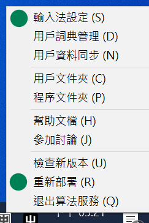
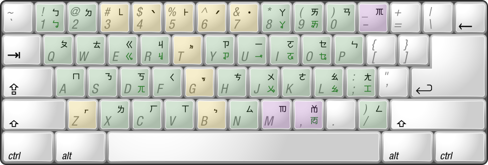

# rime-moetaigi 萌台語: 基於萌典 API 的 RIME 臺語輸入法

萌台語是[中州韻輸入法引擎 (Rime)](https://rime.im/) 的台語輸入法方案，建立在從[萌典 API](https://www.moedict.tw/about.html) 取得的《[臺灣閩南語常用詞辭典](https://twblg.dict.edu.tw/)》兩萬多筆詞條與其發音，讓您使用注音符號（[臺語方音符號](https://zh.wikipedia.org/wiki/%E8%87%BA%E7%81%A3%E6%96%B9%E9%9F%B3%E7%AC%A6%E8%99%9F)）輕鬆輸入台語。

## 特點

1. **相容**　台語的 44 個注音符號與 9 個聲調符號被妥善的安置在鍵盤上，以最大化符合中文注音輸入法使用者的習慣與記憶。幾乎不需要學習新的鍵盤配置，只要你使用注音與大千式鍵盤，就可以運用相同的鍵位來拚打出台語注音！[這裡是詳細的鍵盤配置。](#鍵盤配置)
2. **精確**　台語詞彙的注音拚寫法與對應漢字以《臺灣閩南語常用詞辭典》的[用字原則](https://twblg.dict.edu.tw/holodict_new/compile1_3_9_2.jsp)為基準。可精確的輸入注音與聲調來打字、選字。因此，我保證在《萌典》查到的台語條目可以準確無誤地用此輸入法打出來！

3. **快速**　使用多種來源的字、詞頻表（見[資料來源](#鳴謝與資料來源)）對台語用字進行排序，並且支援簡拼（不打聲調或只打聲符）輸入，幫助使用者在輸入最少拼音符號、最少選字的情況下打出台語文。此外，內建 AI 更會記錄使用者的常用字，打越多直接選到正確字的機會就越高。

4. **詳盡**　與《萌典》同步，透過 API 收錄《[臺灣閩南語常用詞辭典]》本文的兩萬多筆台語字詞。未來更計畫收錄同辭典附錄中的補充字詞。
5. **學習**　「我想要『ㄎㄨㄟˋ』腳」、「『ㄙㄨㄧˋ』啦！」、「『鏡頭』、『縣長』的台語是？」... 不管你是只會念某個台語詞但不知道對應的漢字怎麼寫，還是不知道某個詞彙的台語怎麼念，抑或只是想確定某字的聲調，使用萌台語的簡拚、中文反查，以及注音顯示功能，都可以幫助你快速找到答案。一邊輸入台語，一邊精進你的台語文能力。

6. **標點**　利用 Rime 輸入法方案的特點，打台文的同時可快速輸入常用的全形標點符號。[對應鍵位請參考這裡。](#輸入全形標點符號)
7. **開源**　開放原始碼並使用 CC0 公眾領域授權，任何人都可以不受限制地使用或改進此作品，歡迎各路英雄一同精進本專案、改善程式碼、補充台語字典...！

## 安裝 

### Windows

1. 安裝 [Rime](https://rime.im/) 的 Windows 發行版「**小狼豪**」
2. 下載 [rime-moetaigi](https://github.com/whyjz/rime-moetaigi/archive/refs/heads/main.zip)
3. 解壓縮後找到 `rime-moetaigi/GenYoGothic-L.ttc` 這個檔案，這是**源樣黑體 L**的字型檔。需要安裝此檔案到作業系統內，所有注音與臺文漢字才能正常顯示。字型的授權請見[這裡的說明。](#授權條款)
4. 在同一個資料夾內找到 `moetaigi-tsuim.schema.yaml`、`moetaigi.dict.yaml`、`moetaigi.extended.dict.yaml`、`moetaigi.unspaced.dict.yaml`、`moetaigi.unspaced.schema.yaml`，以及`tsuim.yaml` 六個檔案，複製到 `%APPDATA%\Rime` 資料夾或是用戶自訂的文件夾位置底下。
5. 切換至新安裝的 Rime 輸入法，打開控制選單，**重新佈署** Rime 以後，進入**輸入法設定**啟用「萌台語-注音」(如下圖)。*(您不需要啟用「萌台語-無空格辭典」；這個辭典只要能在輸入法設定中搜尋到，就可以被「萌台語-注音」利用。)*

5. 按下 <code>ctrl + `</code> 後選擇「萌台語-注音」，就可以開始打台語文了！

### 其他作業系統

安裝方式大同小異。在 iOS 上 Rime 的發行版稱為鼠鬚管，而在 Linux 上則稱為 ibus-rime。另外需注意的一點是不同作業系統的[用戶文件夾位置](https://github.com/rime/home/wiki/UserData)也不一樣，需要先確認後再行安裝。

## 簡易功能鍵、輸入鍵位指引

- <code>ctrl + `</code>: 切換至萌台語-注音輸入法或 Rime 提供的其他輸入法
- `shift`: 切換漢字 / 英數輸入
- `空白鍵` 或 `Enter`: 從候選字視窗選字
- <code>`</code>: 進入《中文反查》模式，用中文注音輸入漢字或查詢對應的台語發音。（如果欲查詢的字沒有台語發音的話，會顯示出本字的漢語拼音。）
- `'`: 進入《注音顯示》模式，打字的時候待選詞組的注音會顯示在詞組的右邊。
- 在輸入注音後按下 `'`: 強制分開不同字的注音，例如打「匏仔」簡拼時可以輸入 `ㄅ'ㄚ`，以防輸入法搜尋到 `ㄅㄚ` 的結果。

### 鍵盤配置

注音符號的鍵盤配置請參考下圖。注意深綠色的注音需搭配 `shift` 輸入；例如 `shift + d` 可以輸入「ㄫ」。符號代表的發音請參考臺語注音符號的[維基說明](https://zh.wikipedia.org/wiki/%E8%87%BA%E7%81%A3%E6%96%B9%E9%9F%B3%E7%AC%A6%E8%99%9F)。

  <!-- 要更新 -->
*萌台語-注音輸入法的注音配置。**淺綠色底的按鍵**：與大千式注音鍵盤相同或發音相似的注音。**紅色底的按鍵**：與大千式注音鍵盤不同的注音。**黃色底的按鍵**：聲調符號。 修改自 [Sakurambo](https://commons.wikimedia.org/wiki/File:Keyboard_layout_Zhuyin.svg) 的作品。本作品以 [CC BY-SA 4.0 授權](https://creativecommons.org/licenses/by-sa/4.0/deed.zh_TW)發布。*

### 輸入全形標點符號：

| 輸入 | 呈現 | 
| ---- | ---- |
| `.` | ，|
| `>` | 。 |
| `"` | 、 |
| `\` | ； |
| `=` | ： |
| `[` | 「或〈 |
| `]` | 」或〉 |
| `[[` | 『或《 |
| `]]` | 』或》 |
| `{` | （ |
| `}` | ） |
| `?` | ？ |
| <code>&#124;</code> | ！ |
| `+++` | … |
| `_` | ─ (連接號或半破折號)|
| `+` | ‧ (音界號，又稱間隔號) |
| `~` | ～ |

## 《萌台語》完整說明文檔

這裡可以查閱《萌台語》的安裝、部署、輸入台文，以及使用上的各式細節。（之後補上）

## 鳴謝與資料來源

感謝以下專案與資料來源，以及背後的作者與貢獻者們，讓本輸入法得以奠基與實現：

1. [Rime 中州韻輸入法引擎](https://rime.im/) ([佛振](https://github.com/lotem))
2. [《臺灣閩南語常用詞辭典》](http://twblg.dict.edu.tw/)，使用 [CC BY-ND 3.0 臺灣授權](http://twblg.dict.edu.tw/holodict_new/compile1_6_1.jsp)
3. [萌典](https://www.moedict.tw/)與[萌典 API](https://github.com/g0v/moedict-webkit) ([唐鳳](https://github.com/audreyt))
4. 本輸入法使用如下的台語字詞頻率統計資料：
   - 楊允言等 (2005)，[台語文語料庫蒐集及語料庫為本台語書面語音節詞頻統計](http://ip194097.ntcu.edu.tw/giankiu/keoe/KKH/guliau-supin/guliau-supin.asp)，國科會計畫編號 `NSC 93-2213-E-122-001`，存取日期 2021/09/26。
   - 夢生 (Yuh-ru/Dyertung, 2018)，[部育部臺灣閩南語常用詞辭典語詞字頻表](https://blog.xuite.net/hn88196555/twblog/563937744)，發表於隨意窩 xuite.net，存取日期 2021/09/26。
5. 輸入法使用字型：[源樣黑體](https://github.com/ButTaiwan/genyog-font) ([But Ko](https://github.com/ButTaiwan))
6. 感謝以下 Rime 的官方/客製化輸入法 schema 為本專案的開發提供了範本與靈感：
   - [『注音 洋蔥』](https://deltazone.pixnet.net/blog/post/264319309-%E9%BC%A0%E9%AC%9A%E7%AE%A1%E6%B3%A8%E9%9F%B3%E6%96%B9%E6%A1%88---%E7%AC%A6%E5%90%88%E4%B8%80%E8%88%AC%E6%B3%A8%E9%9F%B3%E4%BD%BF%E7%94%A8%E8%80%85%E7%BF%92%E6%85%A3%E8%A8%AD)(L'Étranger Onion)
   - [『Rime 注音輸入方案』](https://github.com/rime/rime-bopomofo)(佛振)
   - [『意傳台文輸入法』](https://github.com/i3thuan5/rime-taigi)(ÌTHUÂNKHOKI 意傳科技)
   - [『RIME 台語輸入方案』](https://github.com/glll4678/rime-taigi)(莊銘彥)
   - [『Rime 粵語拼音方案』中關於詞彙反查的討論](https://github.com/rime/rime-cantonese/pull/80) ([Ayaka Mikazuki](https://github.com/ayaka14732))

<!-- 昆蟲 https://www.facebook.com/morethandee/photos/a.369345609816495/1097476730336709/?type=3 -->

## 授權條款

在本作品中，**除了源樣黑體 L 的字型檔以及少數以其他授權發佈的圖片外**，作者鄭懷傑 (Whyjay Zheng) 已在法律許可的範圍內，拋棄該著作依著作權法所享有之權利，包括所有相關與鄰接的法律權利，並宣告將該著作貢獻至公眾領域。你可以複製、修改、發布或展示此作品，亦可進行商業利用，完全不需要經過許可。更多資訊可參閱 [LICENSE](LICENSE) 檔或[這裡](https://creativecommons.org/publicdomain/zero/1.0/deed.zh_TW)。

源樣黑體 L 是改造過後 Adobe 開發的「思源黑體」字型，由 [But Ko](https://github.com/ButTaiwan) 所開發，[專案網址可由此進](https://github.com/ButTaiwan/genyog-font)。萌台語輸入法基於 [SIL Open Font License 1.1](SIL_Open_Font_License_1.1.txt) 的授權協議，以相同的授權條款再散佈此字型。

對於以其他授權發佈的圖片，您可以在圖片說明文字中找到授權條款。

## 如何參與開發

萌台語歡迎各路英雄一同參與開發！文檔錯字、補充說明，乃至程式碼改進、擴增新功能... 不管您想到的是什麼，您可以：

1. 開 Issue 提出您的問題與建議，或是未來開發的想法
2. 隨時送一個 PR 過來，一起完善萌台語輸入法！

[您可以參考這裡獲得本專案的更多細節。](#萌台語完整說明文檔)